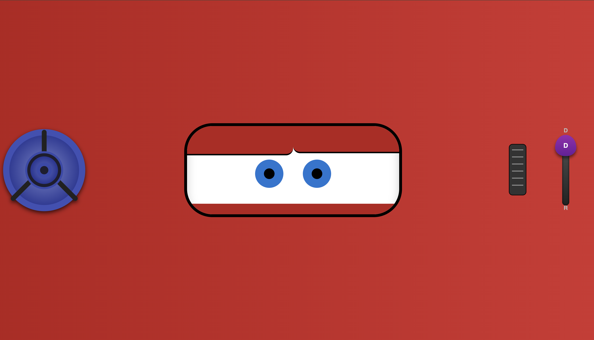
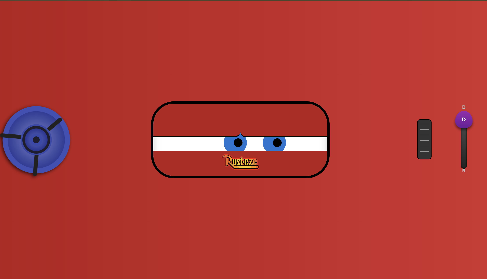
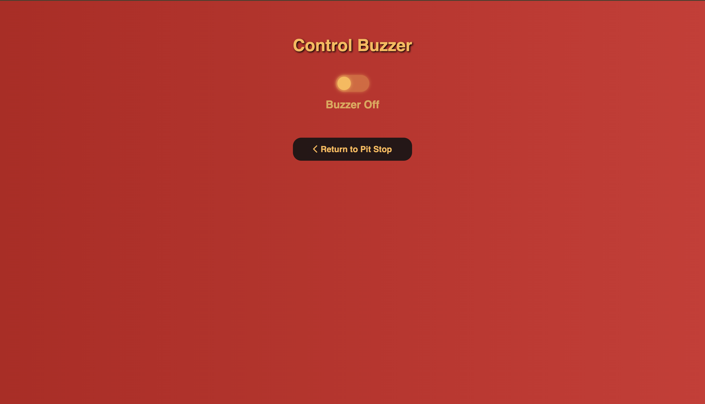

# McQueen ROS 2 Workspace

This workspace is a complete ROS 2-based project for controlling a mobile robot platform ("McQueen") with support for web-based teleoperation, sensor-actuator integration, and voice assistant capabilities.

## Author

**Halil İbrahim ŞENAYDIN**  
E-mail: halilsenaydin@gmail.com  
GitHub: [github.com/halilsenaydin](https://github.com/halilsenaydin)

## Dependencies

- ROS (recommended [iron](https://docs.ros.org/en/iron/Installation/Ubuntu-Install-Debs.html))

## Package Overview

This workspace includes the following packages:

### [mcqueen_hw](./mcqueen_hw)

Hardware abstraction and control package. Provides modular interfaces and concrete implementations for various sensors, actuators, and communication methods.

- **Interfaces (abstract/):**  
  `IBuzzer`, `ICommDevice`, `IController`, `IDistanceSensor`, `IScreen`, `ISpeechRecognizer`

- **Implementations (concrete/):**

  - Buzzers: `ActiveBuzzer`, `PassiveBuzzer`, `MqttBuzzer`
  - Communication: `BluetoothComm`, `BluwtoothAudioComm`, `MqttComm`, `SerialComm`
  - Controllers: `PIDController`
  - Screens: `MqttNextionScreen`
  - Sensors: `HCSR04Sensor`, `MqttDistanceSensor`
  - Speech Recognizers: `WhisperSpeechRecognizer`

- **ROS Nodes (nodes/):**  
  Services and publishers for sensors and actuators:  
  `buzzer_service`, `screen_service`, `distance_publisher`, `motor_controller`

- **System (system/):**  
  ROS 2 hardware integration via `mcqueen_system.h` with `ros2_control`.

[See mcqueen_hw README](./mcqueen_hw/README.md)

### [mcqueen_teleop](./mcqueen_teleop)

Provides a Flask-based web interface and voice assistant integration for teleoperating the robot over a local network (Wi-Fi or LAN). Publishes velocity commands and offers service-based control for other components (buzzer, screen, etc.).

- Publishes `geometry_msgs/Twist` to `/cmd_vel`
- Voice command interface using `spaCy` and microphone input (SSL required)
- MQTT communication support
- Simple HTTP-based service endpoints

[See mcqueen_teleop README](./mcqueen_teleop/README.md)

### [mcqueen_description](./mcqueen_description)

Contains the URDF model of the McQueen robot and associated launch files.

- URDF/Xacro descriptions of robot
- `robot_state_publisher` and `joint_state_publisher` integration
- Launch file to visualize the robot in RViz

[See mcqueen_description README](./mcqueen_description/README.md)

### [custom_interfaces](./custom_interfaces)

Custom ROS 2 interface definitions used across the workspace.

- Custom service definitions (`Screen`, `Buzzer`, etc.)
- Custom message types for extended robot communication

[See custom_interfaces README](./custom_interfaces/README.md)

## Installation

Start by creating a new ROS 2 workspace if you don't already have one:

```bash
mkdir -p ~/workspace/src
cd ~/workspace/src
```

Use Git to download the workspace from the repository:

```bash
git clone https://github.com/halilsenaydin/mcqueen
```

## Screenshots

### MCQueen Description

#### Rviz2 Visualization


### MCQueen HW

#### Foxglove Visualization


### MCQueen Teleop

#### Dashboard


#### Voice Assistant


#### Control Interface





#### Distance Monitor


#### Control Buzzer



#### Control Screen


#### Control Headlight


