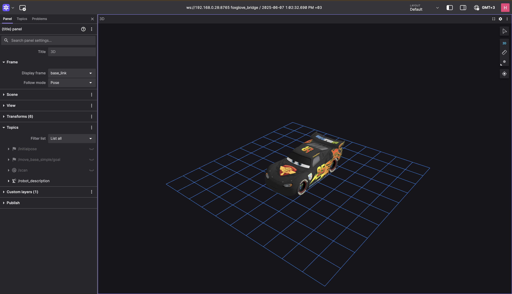

# McQueen HW ROS 2 Package

A modular hardware abstraction and control package for ROS 2-based robot systems.  
Designed for seamless integration with `ros2_control`, MQTT/Bluetooth communication, and various hardware peripherals such as buzzers, ultrasonic sensors, and Nextion displays.

## Author

**Halil İbrahim ŞENAYDIN**  
E-mail: halilsenaydin@gmail.com  
GitHub: [github.com/halilsenaydin](https://github.com/halilsenaydin)

## Dependencies

- ROS 2 (recommended [Iron](https://docs.ros.org/en/iron/Installation/Ubuntu-Install-Debs.html))

## Package Overview

This package is responsible for managing hardware-level operations in a modular, extensible way.

### ROS 2 Control Integration

Implements a `ros2_control`-compatible hardware interface via:

- `mcqueen_system.h`: bridges custom motor/actuator logic to the ROS 2 control pipeline.
- Full support for `controller_manager` and external control nodes.

### Abstract Interfaces (`abstract/`)

These headers define abstract base classes for modularity:

- `IBuzzer`: General buzzer control
- `ICommDevice`: Communication abstraction
- `IController`: Controllers abstraction
- `IDistanceSensor`: Sensor abstraction
- `IScreen`: Screen display abstraction

### Concrete Implementations (`concrete/`)

Classes that implement hardware-specific behaviors:

- **Buzzers**:

  - `ActiveBuzzer`
  - `PassiveBuzzer`
  - `MqttBuzzer`

- **Communication**:

  - [`BluetoothComm`](docs/BluetoothComm.md): Uses serial Bluetooth modules for command transmission.
  - [`MqttComm`](docs/MqttComm.md): Communicates with external systems via MQTT.
  - [`SerialComm`](docs/SerialComm.md): Direct UART/USB serial communication with microcontrollers.

  **Note**: Each communication module includes a dedicated README file with setup instructions, configuration details, and usage examples. Please refer to them for comprehensive guidance.

- **Sensors**:

  - `HCSR04Sensor`
  - `MqttDistanceSensor`

- **Screens**:

  - `MqttNextionScreen`

- **Controllers**:
  - `PIDController`

### ROS Nodes (`nodes/`)

Node-level logic to interact with the above components using ROS interfaces:

- `buzzer_service.h`: Provides service interface for buzzer control
- `distance_publisher.h`: Publishes sensor data (e.g., ultrasonic)
- `motor_controller.h`: Receives and executes velocity commands. Useful when not using ros2_control, providing direct control over motors via custom logic
- `screen_service.h`: Offers text and UI control via service

### ros2_control System (`system/`)

Implements the `HardwareInterface` and exposes:

- Read/write methods for motor feedback and command handling
- Seamless integration with controllers through the `controller_manager`

## Installation

Start by creating a new ROS 2 workspace if you don't already have one:

```bash
mkdir -p ~/workspace/src
cd ~/workspace/src
```

Use Git to download the `mcqueen_hw` package from the repository:

```bash
git clone https://github.com/halilsenaydin/mcqueen
```

### Install Dependencies

Before building the workspace, make sure all system and ROS 2 package dependencies are installed using rosdep:

```bash
# Navigate to the root of your ROS 2 workspace
cd ~/workspace

# Update rosdep database (recommended)
rosdep update

# Install all dependencies defined in package.xml files
rosdep install --from-paths src --ignore-src -r -y
```

### Build Workspace

Navigate to the root of your workspace and build the package using `colcon`:

```bash
cd ~/workspace
colcon build --symlink-install
```

After building, don’t forget to source the setup file before running any ROS 2 commands:

```bash
source install/setup.bash
```

## Usage

To launch the hardware system:

```bash
ros2 launch mcqueen_hw bringup.launch.py
```

## Screenshots


