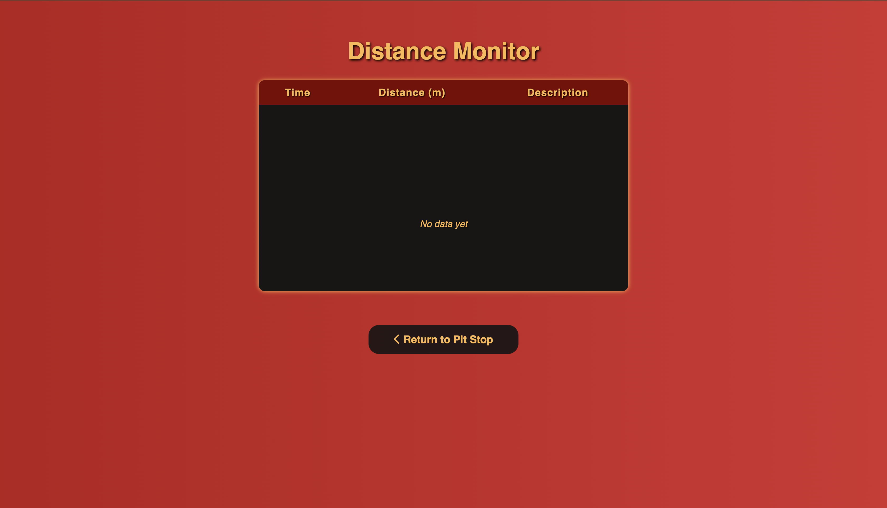

# McQueen Teleop ROS 2 Package

A ROS 2 package for remotely controlling a robot via `/ackermann_cont/reference` topic using a Flask-based web interface.

## Author

**Halil İbrahim ŞENAYDIN**  
E-mail: halilsenaydin@gmail.com  
GitHub: [github.com/halilsenaydin](https://github.com/halilsenaydin)

## Dependencies

- ROS 2 (recommended [Iron](https://docs.ros.org/en/iron/Installation/Ubuntu-Install-Debs.html))
- `flask`, `paho-mqtt`, `spaCy`

## Package Overview

### Remote Manual Control via Web

- Control the robot's motion (forward, backward, turn) from any device on the same network using a responsive web interface.
- Publishes `geometry_msgs/Twist` messages to the `/ackermann_cont/reference topic` (compatible with ros2-control-based robots).

### Web Interface (Flask)

- Lightweight Flask server handles HTTP requests for control and interaction.
- Includes support for real-time button control, command sending, and status feedback.

### Voice Assistant Integration

- Built-in voice command processor using `spaCy` for natural language understanding.
- Easily extendable for more complex commands or dialogue-based interaction.

### Additional Hardware Support

- Built-in service clients for controlling:

  - Screen display (via `custom_interfaces/srv/Screen`)
  - Buzzer (via `custom_interfaces/srv/Buzzer`)

- Modular design allows easy integration of more actuators or sensors.

### Modular and Extensible

- Clean codebase with separation between ROS logic, web server, and voice processing.

- Easily customizable for other robots or different control topics.

## Installation

Start by creating a new ROS 2 workspace if you don't already have one:

```bash
mkdir -p ~/workspace/src
cd ~/workspace/src
```

Use Git to download the `mcqueen_teleop` package from the repository:

```bash
git clone https://github.com/halilsenaydin/mcqueen
```

### Install Dependencies

Some required Python packages such as Flask, spaCy, and paho-mqtt are not installed via rosdep and must be installed with pip. Make sure you have them installed:

```bash
pip3 install -r mcqueen_teleop/requirements.txt
```

After installing spacy, download the appropriate language model:

```bash
python3 -m spacy download xx_ent_wiki_sm
```

Before building the workspace, make sure all system and ROS 2 package dependencies are installed using rosdep:

```bash
# Navigate to the root of your ROS 2 workspace
cd ~/workspace

# Update rosdep database (recommended)
rosdep update

# Install all dependencies defined in package.xml files
rosdep install --from-paths src --ignore-src -r -y
```

### Build Workspace

Navigate to the root of your workspace and build the package using `colcon`:

```bash
cd ~/workspace
colcon build --symlink-install
```

After building, don’t forget to source the setup file before running any ROS 2 commands:

```bash
source install/setup.bash
```

## Usage

### Secure Microphone Access with SSL

For security reasons, the microphone interface requires SSL/TLS encryption. You need to generate a self-signed certificate and a private key before running the application.

To create these, run the following command in your terminal:

```bash
cd ~/workspace

openssl req -x509 -newkey rsa:4096 -keyout key.pem -out cert.pem -days 365 -nodes
```

This command will generate:

- `key.pem` — Your private key file

- `cert.pem` — Your self-signed certificate valid for 365 days

### Exec Node

Run the `web_server` node from the `mcqueen_teleop` package. This will start a Flask-based web interface for remote control:

```bash
ros2 run mcqueen_teleop web_server
```

Once the server is running, open your browser and go to:

```bash
https://<your-ip>:5050
```

Replace `<your-ip>` with the IP address of the machine running the server. For example:

```bash
https://192.168.0.36:5050
```

To make sure the velocity commands are being published, you can echo the `/ackermann_cont/reference` topic in another terminal:

```bash
ros2 topic echo /ackermann_cont/reference
```

This will display real-time `geometry_msgs/msg/Twist` messages being sent from the web interface.

## Screenshots

### Dashboard


### Voice Assistant


### Control Interface


### Distance Monitor



### Control Buzzer


### Control Screen


### Control Headlight


